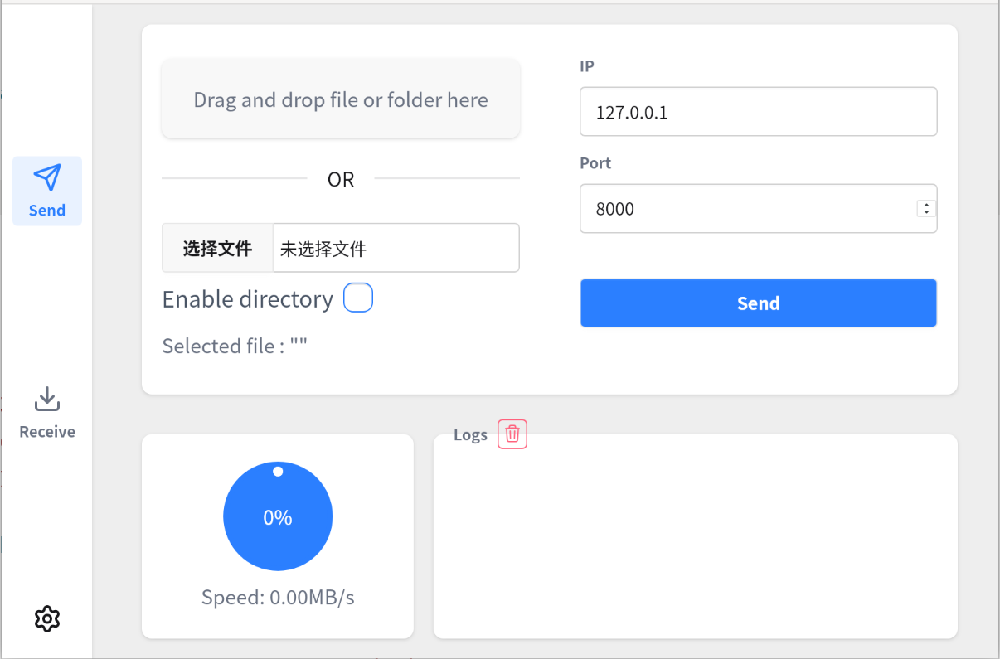
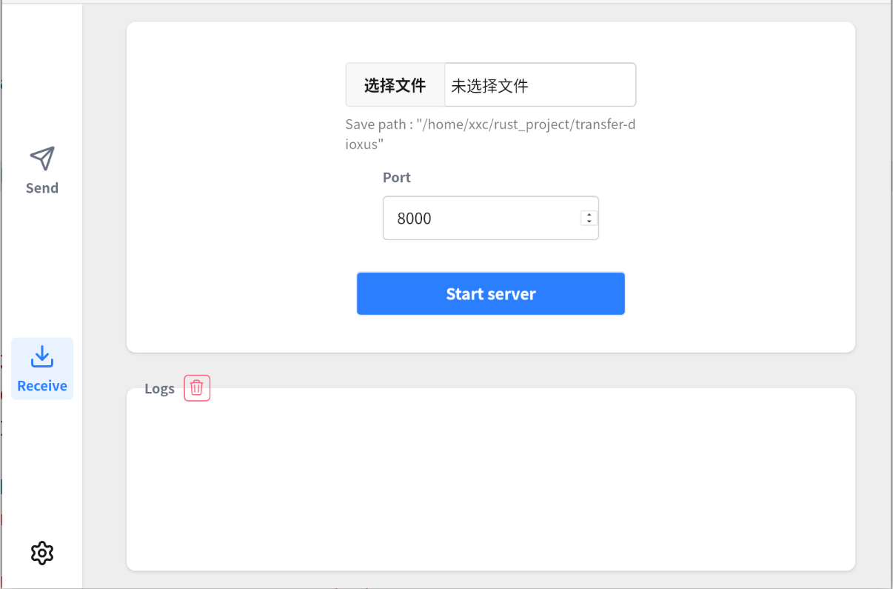

# Simple File Transfer (Dioxus)

A lightweight, cross-platform file transfer utility built with **Rust** and **Dioxus**. This tool allows you to easily transfer files and directories across a Local Area Network (LAN) between Linux, Windows, and macOS. It also supports local loopback for testing purposes.

## 🚀 Features

* **Cross-Platform Support:** Seamlessly runs on Linux, Windows, and macOS.
* **Easy Transfer:** Drag-and-drop support for individual files and entire folders.
* **LAN Connectivity:** Transfer data directly between devices on the same local network.
* **Visual Feedback:** Real-time transfer speed indicator and progress monitoring.

## 🛠️ Getting Started

### Prerequisites
Make sure you have installed the **Rust** and **Dioxus** development environment.

### Installation & Running

1.  **Install Dioxus CLI:**
    ```bash
    cargo install dioxus-cli
    ```

2.  **Run the Project:**
    Navigate to the project directory in your terminal and start the development server:
    ```bash
    dx serve
    ```

## 📖 Usage Guide

The interface is divided into two main functions accessible via the sidebar:

### Sending Files (Send Tab)



1.  Drag and drop a file/folder onto the area, or select one manually.
2.  Enter the receiver's target **IP Address**.
3.  Enter the target **Port** (default: `8000`).
4.  Click the **Send** button to start the transfer.

### Receiving Files (Receive Tab)



1.  Choose a **Save path** where incoming files will be stored.
2.  Set the **Port** to listen on (must match the sender's port).
3.  Click **Start server**.
4.  Incoming connections and transfer status will appear in the **Logs** section.
